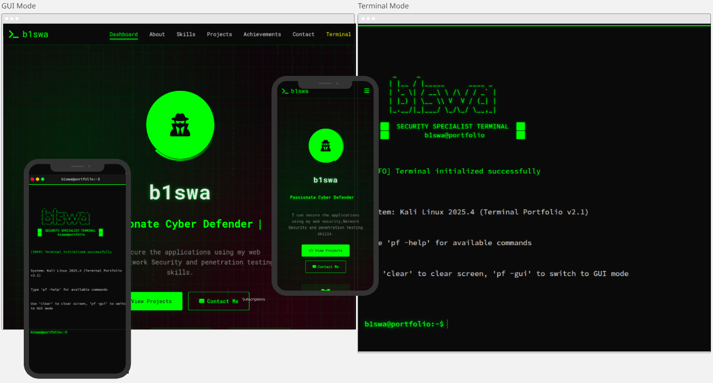

# b1swa | Security Specialist Portfolio

A premium, dual-mode portfolio website featuring an interactive **Terminal Interface** and a sleek **Graphical User Interface (GUI)**. Designed with a focus on cybersecurity aesthetics and clean, maintainable code.



## 🚀 Quick Start (Local Development)

Because this portfolio uses dynamic component loading (for shared headers and footers), it **requires a local server** to run correctly. Opening the `index.html` file directly in your browser will cause CORS errors.

### Option 1: Using Python (Recommended)
Open your terminal in the project root and run:
```bash
python3 -m http.server 8000
```
Then visit: [http://localhost:8000](http://localhost:8000)

### Option 2: Address Already in Use?
If you get an error saying the port is in use, run this to clear it and restart:
```bash
fuser -k 8000/tcp; python3 -m http.server 8000
```

---

## 🛠 Features

- **Dual Mode**: Switch between a hackers-style Terminal and a modern GUI.
- **Dynamic Components**: Shared Header and Footer partials for easy maintenance.
- **SEO Optimized**: Unique meta tags and titles for every subpage.
- **Security Specialist Signature**: Includes a standardized `.well-known/security.txt`.
- **Responsive Design**: Fully optimized for mobile, tablet, and desktop.

## 📂 Project Structure

```text
.
├── assets/
│   ├── css/      # Organized style.css with structural banners
│   ├── js/       # Documented script.js with JSDoc
│   └── images/   # Original visual assets
├── pages/        # Subpages (About, Skills, Projects, etc.)
├── partials/     # Shared components (_header.html, _footer.html)
├── .well-known/  # security.txt
└── index.html    # Entry point & View Selector
```

## 🔐 Security Professionalism
This project follows professional standards for security researchers by including a `security.txt` file at `/.well-known/security.txt` to define contact information and security policies.

---

## 🤝 Contact
- **Email**: sandipbiswa2000@gmail.com
- **GitHub**: [sun272000](https://github.com/sun272000)
